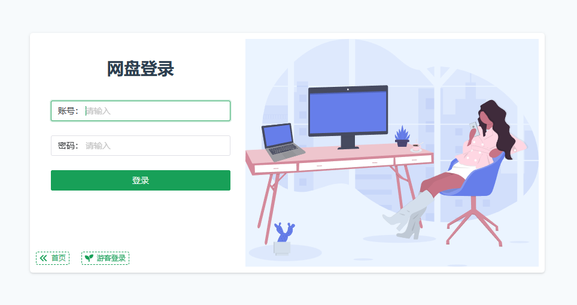
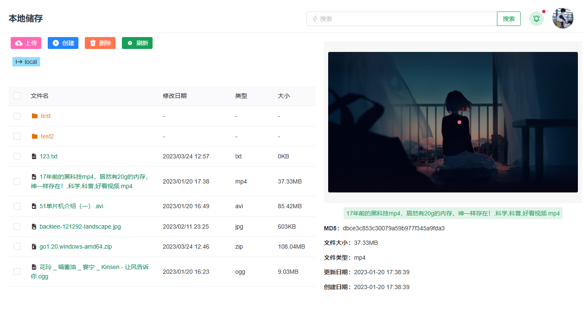
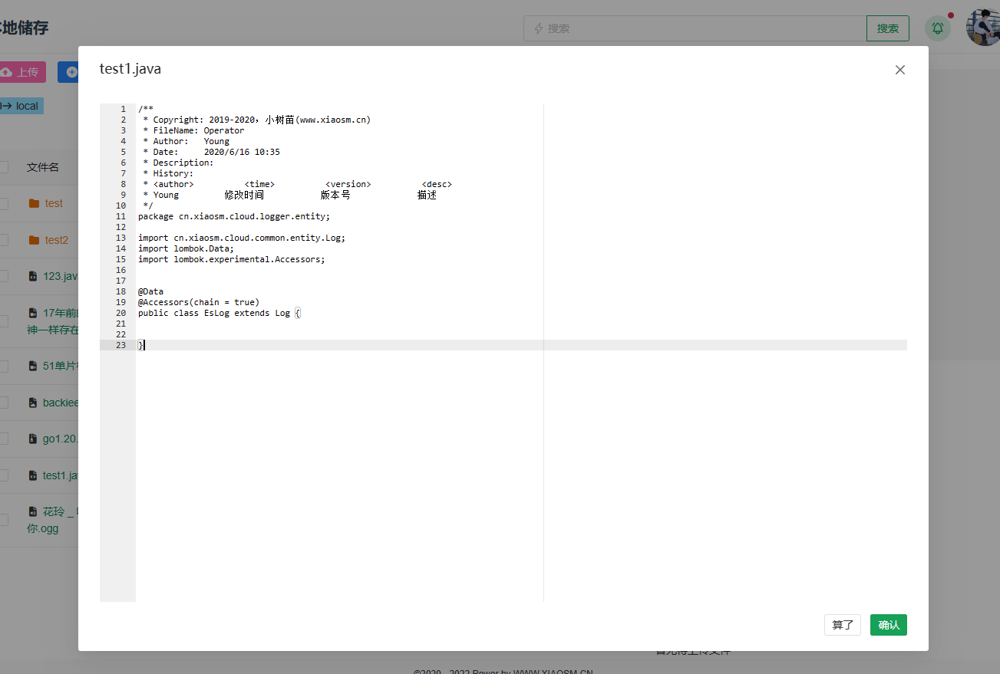
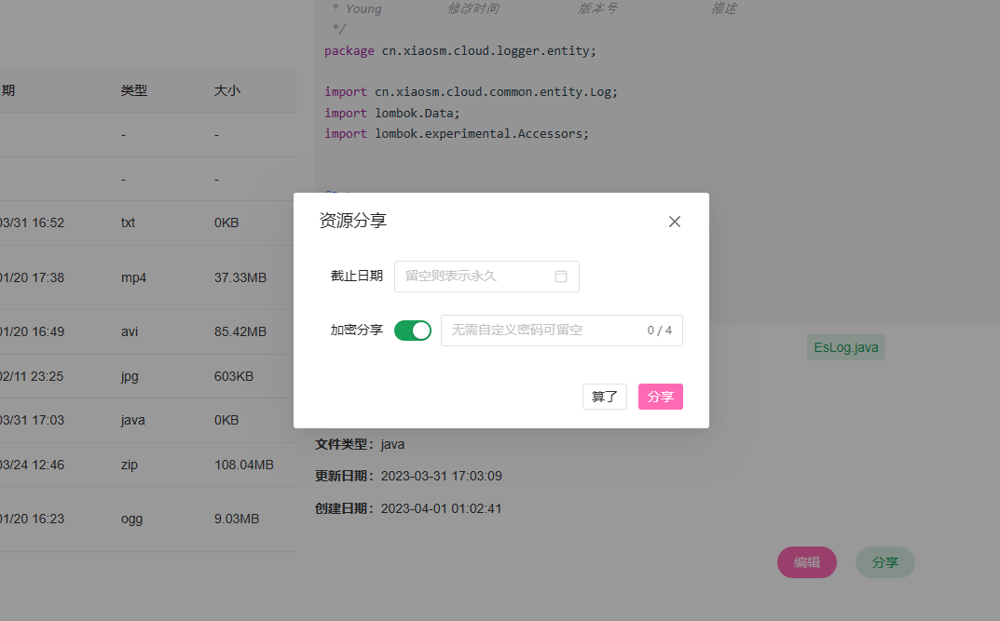
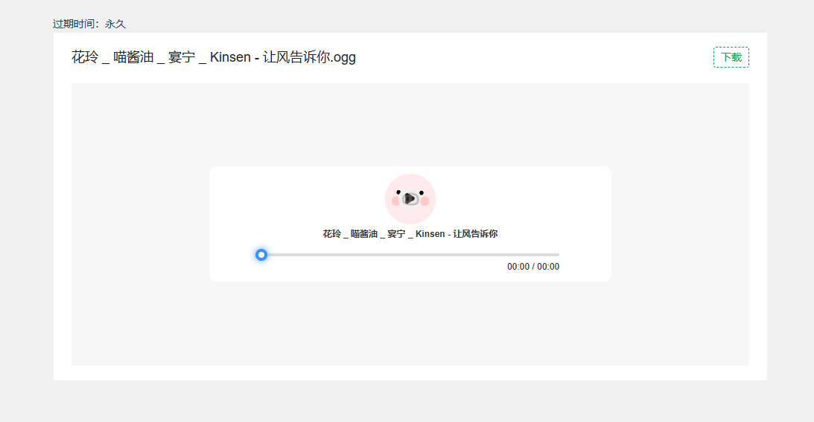

# 私有云存储网盘

### 预览地址
[https://cloud.xiaosm.cn](https://cloud.xiaosm.cn)，选择游客登陆，密码xiaoyang

## 🔮 介绍
本项目是一人云盘存储系统，为解决部分用户在上传文件或下载文件时受到第三方平台的限速、或需要文件私有化、有文件在线预览需求等  

支持文件上传、下载、在线预览、编辑、分享等功能

本项目在[**RBAC权限系统**](https://github.com/MieMieDeYi/YAdmin)上进行开发   
项目使用前后端分离的方式进行开发，使用JWT技术进行token下发和管理

## 🪄 项目主要技术框架
* 前端：TypeScript、Vue3、axios、Naive UI、Element UI Plus
* 后端：Springboot、Spring-Security、JWT、Mybatis-plus
* 持久层：Mysql8、Redis、ElasticSearch

## ✨ 项目特点
* 使用jdk17和ts，主流的技术栈，方便学习和开发
* 精准的权限控制系统，多角色、多权限分发
* 文本、音频、视频在线预览，文本文件在线编辑等
* 资源文件分享，可设置加密密码和过期时间，分享文件可直接预览
* 双端支持，同时支持手机端和PC端设备
* 文件资源管理器页面支持右键菜单，切换使用无需重新适应
* 支持文件断点续传、多线程下载技术等
* 可扩展的ElasticSearch日志服务，对系统操作、系统报错等日志分类管理和检索

## 🔭 后续功能
1. [x] 文件搜索
2. [ ] 文件离线下载
3. [ ] 文件加速（上传至OSS等云储存）
4. [ ] WebDav支持

## 🗂️ 项目结构
后端项目采用maven多模块开发
```
- cloud-core 项目核心代码模块
  - admin 项目后台管理
  - aspect 切面处理
  - config 配置类，所有配置类均在此包下
    - security 
  - controller 控制层
  - entity 实体类
  - exception 自定义异常
  - interceptor 拦截器
  - mapper 持久层
  - scheduler 定时任务中的调度任务
  - service 业务层

- cloud-common 公共模块
  - annotation 自定义注解
  - util 工具类
  
- cloud-security 权限模块
  - config 对spring-security的配置
  - service JWT构建、参数加解密服务
  - handler spring-security的回调处理器

- cloud-logger 日志模块
```
前端使用vue3进行开发，项目构建使用vite
```
- cloud-vue-ts
  - assets 静态文件资源
  - components 组件模块
  - http 后台接口API
  - views 页面视图
```

## 🧩 项目截图






